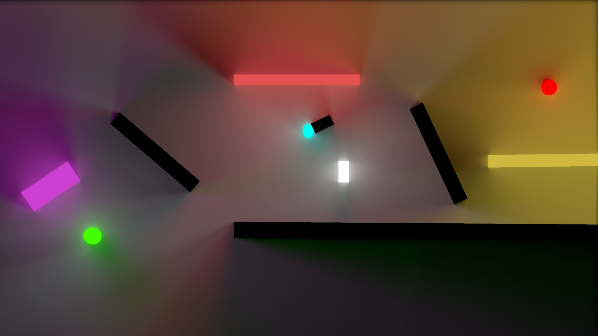

# Unity 2D Radiance Cascade Demo

This repository provides a basic implementation of a global illumination technique based on the concept of Radiance Cascades, as described in the paper [Radiance Cascades: A Novel Approach to Calculating Global Illumination](https://drive.google.com/file/d/1L6v1_7HY2X-LV3Ofb6oyTIxgEaP4LOI6/view).

The illumination algorithm is applied as a post-processing effect on the main camera.
The repository includes two versions for better understanding and portability:
- **3D Texture Implementation**: For easy understanding of the technique.
- **2D Texture Implementation**: For greater portability across different platforms.

Enjoy experimenting with the demo, and happy coding!
